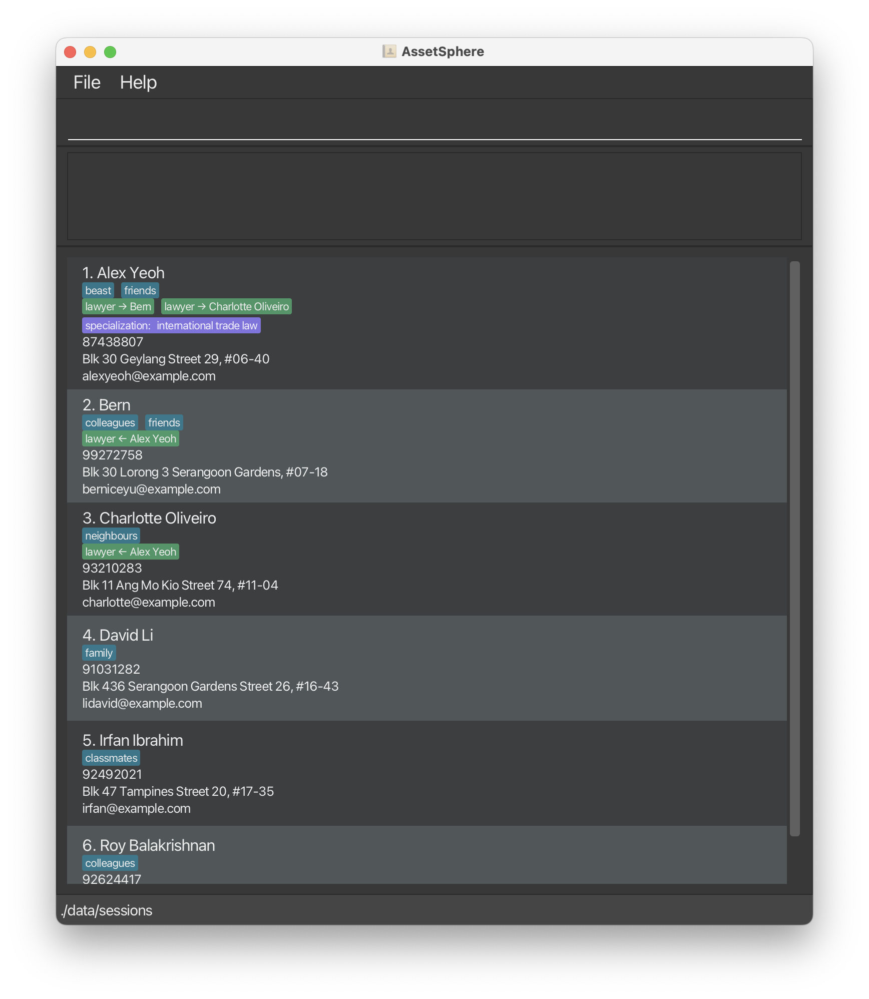

# AssetSphere User Guide

AssetSphere is a **desktop app for managing contacts, optimized for use via a Command Line Interface** (CLI) while still having the benefits of a Graphical User Interface (GUI). If you can type fast, AssetSphere can get your contact management tasks done faster than traditional GUI apps.

<!-- * Table of Contents -->
<page-nav-print />

--------------------------------------------------------------------------------------------------------------------

## Quick start

1. Ensure you have Java `17` or above installed in your Computer.<br>
   **Mac users:** Ensure you have the precise JDK version prescribed [here](https://se-education.org/guides/tutorials/javaInstallationMac.html).

1. Download the latest `.jar` file from [here](https://github.com/AY2526S1-CS2103T-T13-2/tp/releases).

1. Copy the file to the folder you want to use as the _home folder_ for your AssetSphere.

1. Open a command terminal, `cd` into the folder you put the jar file in, and use the `java -jar assetsphere.jar` command to run the application.<br>
   A GUI similar to the below should appear in a few seconds. Note how the app contains some sample data.<br>
   

1. Type the command in the command box and press Enter to execute it. e.g. typing **`help`** and pressing Enter will open the help window.<br>
   Some example commands you can try:

   * `list` : Lists all contacts.

    * `add "Betsy Crowe" "1234567" "Newgate Prison" "betsycrowe@example.com" /tag:friend /tag:criminal` : Adds a contact named `Betsy Crowe` to the address book.

   * `delete 3` : Deletes the 3rd contact shown in the current list.

   * `clear` : Deletes all contacts.

   * `exit` : Exits the app.

1. Refer to the [Features](#features) below for details of each command.

--------------------------------------------------------------------------------------------------------------------

## Features

<box type="info" seamless header="Basic Command Structure">

All commands follow the same simple format:

`command <parameters...> <options...>`

1. **Command:** The action you want to perform (e.g., `add`, `list`, `delete`).
2. **Parameters:** Inputs the command _needs_ to work. These are usually **required**, and their **order matters**.
3. **Options:** Optional settings that change _how_ the command works. They always start with a slash (`/`) and can be in **any order**, but must come _after_ all parameters.

**Parameters**

Parameters are the main inputs for a command.
- **Order is Key:** You must provide them in the specific order shown in the command's help text.
- **Handling Spaces:** If your parameter includes spaces, you **must** wrap it in straight quotes (`""`).
    - `add "New task"` (This is one parameter: "New task")
    - `add New task` (This is two parameters: "New" and "task")
- **Parameter Types:** Some commands use special prefixes for parameters:
    - **Normal:** `"My task"`
    - **Additive:** `+tag` (Used to add an item, like a tag)
    - **Subtractive:** `-tag` (Used to remove an item, like a tag)

**Options**

Options are optional settings to customise your command. They always come _after_ all parameters. There are two types of options:
1. **Name-only (Flag):** Used to turn a setting on.
    - **Example:** `list /all` (The `/all` flag might show completed items)
2. **Name-Value Pair:** Used to provide a specific value for a setting. Use a colon (`:`) to separate the name and value.
    - **Example:** `add "Finish report" /priority:high`
    - If the value has spaces, wrap the value in quotes: `add "New event" /due:"tomorrow at 5"`

#g#To avoid cluttering the syntax for each command, options may be specified in a particular order in the formats given below for better readability. However, it is always fine to specify the options in **any order**.##

When you look at the help for a command, you'll see this notation:

- **Parameter Variants:**
    - The acceptable parameter variants are placed as a prefix before the field, e.g. (+, -) `<tag>`. By default, if the variant is not specified, then the parameter must be a normal parameter and not have any prefix.
    - (*): Normal parameter (no prefix)
    - (+): Additive parameter (prefix `+`)
    - (-): Subtractive parameter (prefix `-`)
- **Field Types:**
    - `(string)`: Text that can be a single `word` or `"text with spaces"`.
    - `(word)`: Text that must be a single `word` (without quotes).
    - `(index)`: A positive number (like `1`, `2`, `3`) corresponding to the 1-indexed index of a person in the current filtered list displayed.
- **Multiplicity (How many?):**
    - `<item>`: Exactly one is required.
    - `<item>?`: Zero or one (it's optional).
    - `<item>+`: One or more are required.
    - `<item>*`: Zero or more (it's optional and you can provide many).
    - Multiple items may be grouped with square brackets `[]` and assigned a multiplicity. In such a case, the entire group may be repeated as many times as specified.

_Example:_ `edit <index>+ [/tag:<tag>]+` means you must provide at least one index, followed by at least one tag with option key `tag`. These are all acceptable inputs:
- `edit 1 /tag:friend`
- `edit 1 /tag:enemy`
- `edit 1 /tag`
- `edit 1 /tag:enemy /tag:colleague`

**Whitespace and Special Characters**

- #m#Whitespace is ignored unless it is wrapped in quotes (`""`).##
- #m#If you wish to pass special characters (non-alphanumeric: anything that is not a letter or number) to a field, you must wrap it in quotes (`""`).##

**Extraneous Parameters and Options**

By default:
- #r#The number of parameters are fixed for commands and should be strictly adhered to. Using a number of parameters that does not conform to the requirements of the command format is **undefined behaviour** (we leave it to individual commands to decide what to do). In most cases, this is an error.##
- #m#Some commands may gracefully handle extraneous parameters if it is sensible to do so, but this behaviour _should not be relied on_.##
- #m#Extraneous options are *always* ignored, unless the command allows variable option keys (it cannot tell what the difference is between a legitimate option key and one that is extraneous).##
- #m#If an option name is specified multiple times when the command expects it to be specified only once, it will accept the first value specified.##

</box>

<box type="important" seamless header="Built-in and Custom Fields">

The following are **built-in simple fields**. There are additional restrictions on each of them:
- `name` must only contain letters, numbers, or spaces, and it should not be blank
- `phone` must only contain numbers, and it should be at least 3 digits long
- `address` must not be blank
- `email` must be of a valid email address form
- `tag` must only contain letters and numbers

For **custom fields** (those added with the `field` command):
- Custom field names must only contain letters and numbers
- Custom field values must not be blank

</box>

### Command Inference

If you type a command keyword/imperative partially, and the partial command keyword/imperative you typed in is a unique prefix of exactly one of these commands, then that command will be run.

For example:
- `ed 1 /name:"John Doe"` resolves to the equivalent command `edit 1 /name:"John Doe"`
- `e` results in an error: both `edit` and `exit` have this prefix, so it is ambiguous as to which command should be run.
- `x` results in an error: there are no command imperatives that begin with the letter `x`, so there is no valid command to run.

**Errors and Warnings**

* #r#If more than one command or no commands are found, an error occurs and no command is run.##
* #m#The command to run is inferred only from the keyword/imperative supplied, and not from any of the parameters or options given.##

### Viewing help : `help`

Shows a message explaining how to access the help page.


Format: `help`

_Additional notes:_

* Although the documented format shows no parameters, the parser accepts any additional text after the command word. Inputs such as `help 123` are treated the same as `help` and open the help window without error.

### Adding a person: `add`

Adds a person to the address book.

Format: `add <name> <phone> <address> <email> [/tag:<tag>]*`

**Parameters**

* `<name>` (string): a valid name
* `<phone>` (string): a valid phone number
* `<address>` (string): a valid address
* `<email>` (string): a valid email address

**Options**

* `<tag>` (string): a valid tag name

**Examples**

* `add "John Doe" 98765432 "John street, block 123, #01-01" "johnd@example.com"`
* `add "Betsy Crowe" "1234567" "Newgate Prison" "betsycrowe@example.com" /tag:friend /tag:criminal`

**Warnings and Errors**

* #r#Values for each field must conform to the listed restrictions above.##

### Listing all persons : `list`

Shows a list of all persons in the address book.

Format: `list`

### Viewing command history : `history`

Displays the list of commands previously entered.

Format: `history`

Examples:
* `history` — displays a numbered list of past commands in the format `N. COMMAND_TEXT` (oldest first).

  Example output:

  ```
  1. add /name:"John Doe" /phone:98765432
  2. list
  3. delete 2
  ```

### Editing a person : `edit`

Edits an existing person in the address book.

Format(s):
- `edit <index> [/<field>:<new-value>]+`
- `edit <index> [/<field>:<new-value>]+ [/tag]`

* Existing values will be updated to the input values.
* When editing tags, the existing tags of the person will be removed i.e adding of tags is not cumulative.
* You can remove all the person’s tags by typing `/tag` without specifying any tags after it.
* Edit cannot be used to modify custom fields or links.

**Parameters**

* `<index>` (<tooltip content="A positive number (like `1`, `2`, `3`) corresponding to the 1-indexed index of a person in the current filtered list displayed.">index</tooltip>): index of person to edit

**Options**

* #r#At least one optional field must be provided.##
* `<field>` (word): one of the available simple fields on a person (one of `name`, `phone`, `address`, `email`, `tag`)
  * #m#Option keys are case-sensitive.##
* `<new-value>` (string): any valid field entry (dependent on the modified field)
  * For options other than `tag`, a value **must** be specified.
  * If `tag` is specified without any value, all tags on the person are removed.
  * The `tag` can be specified repeatedly with multiple distinct values.

**Examples**

* `edit 1 /phone:91234567 /email:"johndoe@example.com"` edits the phone number and email address of the 1st person to be `91234567` and `johndoe@example.com` respectively.
* `edit 2 /name:"Betsy Crower" /tag` edits the name of the 2nd person to be `Betsy Crower` and clears all existing tags.
* `edit 3 /tag:friend /tag:colleague` edits the tags of the 3rd person to be `friend` and `colleague` only, clearing all previous tags.
* `edit 3 /tag /tag:friend /tag:colleague` edits the tags of the 3rd person to be `friend` and `colleague` only, clearing all previous tags; this is functionally identical to the previous example.

**Warnings and Errors**

* #r#Values for each field must conform to the listed restrictions above.##
* #m#If the `tag` field is specified with values, any empty-value options specified for `tag` are ignored (see above examples).##

### Modifying tags : `tag`

Adds/removes tags to/from a person.

Format: `tag <index> [(+|-)<tag>]+`

* Adds tags specified with the `+` prefix to the person at the given `<index>` in the displayed list.
* Removes tags specified with the `-` prefix to the person at the given `<index>` in the displayed list.

**Parameters**

* `<index>` (<tooltip content="A positive number (like `1`, `2`, `3`) corresponding to the 1-indexed index of a person in the current filtered list displayed.">index</tooltip>): index of person to modify
* (+, -) `<tag>` (string): tags to add to or remove from a person

**Examples**

* `list` followed by `tag 2 +friend +cool` will add `friend` and `cool` to the 2nd person in the address book.
* `list` followed by `tag 1 -villain -enemy` will remove `villain` and `enemy` from the 1st person in the address book.
* `list` followed by `tag 2 +friend -villain +cool -enemy` will add `friend` and `cool` to and remove `villain` and `enemy` from the 2nd person in the address book.

**Warnings and Errors**

- #r#At least one tag change must be specified.##
- #m#The command does not warn if:##
    - #m#the tags to be added already exist,##
    - #m#the tags to be removed don't already exist, or##
    - #m#at least one tag change is specified, but the tag changes end up having no effect.##

### Adding information to a person: `info`

Edits information about a person given its index.

Format: `info <index>`

* Displays an editable text box for the person at the given `<index>` in the displayed list.
* If there is existing information attached to the person, it will be shown and editable in the text box.

**Parameters**

* `<index>` (<tooltip content="A positive number (like `1`, `2`, `3`) corresponding to the 1-indexed index of a person in the current filtered list displayed.">index</tooltip>): index of person to modify

Examples:
* `list` followed by `info 2` will bring up an editable text box for the 2nd person in the address book.

### Setting and removing a custom field on a person : `field`

Sets, updates or removes one or more **custom field values** for the specified person in the address book.

Format: `field <index> [/<key>[:<value>]?]+`

**Parameters**

* `<index>` (<tooltip content="A positive number (like `1`, `2`, `3`) corresponding to the 1-indexed index of a person in the current filtered list displayed.">index</tooltip>): Index of person to add fields to

**Options**

* #r#At least one optional field must be provided.##
* `<key>` (word): name of custom field (strictly alphanumeric)
* `<value>` (string): value of custom field
  * Each `key` accepts exactly one associated `value` in a command. A command like `field 1 /brand:nike:adidas` will be **rejected**.
  * Surrounding whitespace in both `key` and `value` is trimmed before applying the change.
  * Custom field `key` is **case-sensitive**; `key` is not equivalent to `Key`.
  * Providing a `value` **adds or updates** the custom field identified by `key`. New keys are created automatically; existing keys are overwritten.
    * While you **can** do `field 1 /brand:nike /brand:adidas`, the person at index 1 will only be updated with the custom field `brand: nike`. `/brand: adidas` will be ignored.
  * Omitting `value` (e.g. `/nickname`) **removes** the custom field identified by `key` if it exists.
  * Custom field names are case-insensitive when checked against reserved keys. You cannot use the built-in field names `name`, `email`, `phone`, `address`, `tag`, `field` or with keywords such as `to` and `from` (in any casing).
  * `key` cannot contain spaces, even if wrapped in straight double quotes; A `key` like `"Asset Class"` will be rejected, whereas an alternative like `AssetClass` will be accepted.
  * If a `value` contains spaces or special characters ('@', '?', '!' etc.), wrap it in straight double quotes, e.g. `/notes:"Met @ FinTech conf 2025!"`.

You may mix additions/updates and removals in a single command by providing multiple key-value options.

Examples:
* `field 5 /linkedInUsername:alextan /rate:120`: Sets two fields on the 5th person in one command.
* `field 3 /notes:"Met at FinTech conf 2025"`: Adds a note with spaces to the 3rd person.
* `field 4 /nickname`: Removes the `nickname` custom field from the 4th person.
* `field 7 /birthday:"1999-02-10"`: Creates or updates the `birthday` custom field on the 7th person.
* `field 2 /assetClass: Gold /socialMedia`: Sets the field `assetClass`, and removes the field `socialMedia` on the 2nd person in one command.

### Locating persons by name: `find`

Finds persons whose fields contain any of the given keywords.

Format: `find <keyword>+ [/<field>]*`

* If no specific field is provided, all built-in fields (not including custom fields and links) will be searched.
* The search keyword is case-insensitive. e.g `hans` will match `Hans`.
* The order of the keywords does not matter. e.g. `Hans Bo` will be treated the same as `Bo Hans`.
* Only full words will be matched e.g. `Han` will not match `Hans`.
* Persons matching at least one keyword on any one field will be returned (i.e. `OR` search).
  e.g. `Hans Bo` will return `Hans Gruber`, `Bo Yang`

**Parameters**

* `<keyword>` (string): keyword to search on. Only fields containing the full word (case-insensitive) will be matched. Multi-worded strings for keywords like `"alex yeoh"` is not allowed, unquote them as such, `alex yeoh`.

**Options**

Note that if specifying to search on built in fields (name, address, phone, email, tag, from, to), it should be all lowercase. For eg, `/name` NOT `/NAME`.
* `/<field>` (word): one of any of the available simple fields on a person (one of `name`, `phone`, `address`, `email`, `tag`)
* `/from` (word): search all links where the person matched is the linker.
* `/to` (word): search all links where the person matched is the linkee (one being linked to).
* `/<custom-field>` (word): specified to search on persons' custom added fields. (does not match if field provided is not existent)

Examples: (no specified fields to search on, default all built in)
* `find 99999999` returns all persons whose built-in fields contain `99999999`.
* `find test.dummy@gmail.com` returns all persons whose built-in fields contain `test.dummy@gmail.com`.
* `find friend` returns all persons whose built-in fields contain `"friend"`.

You can limit the search to specific fields by adding options after your keywords (see above under **Options**).
* Each field option starts with / followed by the field name.
* The same rules for searching applies as per the case of searching all built in fields. (see above)
* Now, only those persons matching at least one keyword on any one specified field will be returned.

Examples:
* `find John /name` returns persons whose name contains `john`.
* `find gold /assetclass` returns all persons with custom field called `assetclass` and value contains the word `gold`.
* `find 99999999 /phone` returns all persons whose phone number contains the word `99999999`.
* `find test /name /email` returns all persons whose name or email contains the word `test`.
* `find lawyer /from` returns all persons who are the linkers to other persons with linkname containing the word `lawyer`.
* `find lawyer /to` returns all persons who are the linkees to other persons with linkname containing the word `lawyer`.

### Creating links between persons: `link`

Creates a relationship link between two persons in the address book.

Format: `link <index-from> <link-name> <index-to>`

* Establishes a directed relationship where the person at `<index-from>` is the `<link-name>` of the person at `<index-to>`.
* Both persons will display the link in their contact cards with the specified directions.
* Self-links (e.g. linking a person to themselves) are not allowed.
* If the same link already exists, the command will have no effect.
* Editing/deleting a person with a link to someone will make the necessary changes in the address book.

**Parameters**

* `<index-from>` (index): index of the linker (the person initiating the link)
* `<link-name>` (string): name of the relationship (eg., lawyer, client)
* `<index-to>` (index): index of the linkee (the person being linked to)

Examples:

* `list` followed by `link 1 lawyer 2` will result in person 1 becoming the lawyer of person 2.
* `list` followed by `link 2 "best-friend" 3` will result in person 2 becoming the best-friend of person 3 (note that quotes allow link names with special characters).

### Deleting a person : `delete`

Deletes the specified person from the address book.

Format: `delete <index>`

* Deletes the person at the specified `<index>`.

**Parameters**

* `<index>` (<tooltip content="A positive number (like `1`, `2`, `3`) corresponding to the 1-indexed index of a person in the current filtered list displayed.">index</tooltip>): index of person to delete

**Examples**

* `list` followed by `delete 2` deletes the 2nd person in the address book.
* `find Betsy` followed by `delete 1` deletes the 1st person in the results of the `find` command.

_Additional notes:_

* The command ignores any extra arguments that follow the index. For example, `delete 2 extra words` will delete the 2nd person exactly as if `delete 2` had been entered.

### Clearing all entries : `clear`

Clears all entries from the address book.

Format: `clear`

### Exiting the program : `exit`

Exits the program.

Format: `exit`

_Additional notes:_

* Any extra words typed after `exit` are ignored. For instance, `exit now` will still close the application.

### Recalling previous commands (Up / Down arrow keys)

While the command box is focused you can press the Up and Down arrow keys to cycle through previously entered commands.
Press Up to recall the most recent command (and keep pressing Up to move to older commands). Press Down to move forward in the history; pressing Down when there is no newer command will clear the command box.

After recalling a command, press Enter to execute it. This is useful for quickly re-running or editing recent commands without retyping them.

_Additional notes:_

* Like the `history` command, only valid commands will be saved and cycled. Invalid commands will ignored.

### Saving the data

AssetSphere data are saved in the hard disk automatically after any command that changes the data. There is no need to save manually.

#### Session snapshots

In addition to the main address book file, AssetSphere writes a snapshot of your current session (recent commands, active `find` keywords, and window layout) every time the app exits normally. These JSON files live beside the main data file inside a `sessions/` sub-folder, for example:

```
[JAR file location]/data/sessions/session-2025-10-18T12-34-56-789-Asia-Singapore.json
```

At start-up AssetSphere loads the most recent valid snapshot so that the app opens with the same filters and window placement you last used. You can safely delete older session files if you want to reclaim disk space; the app will automatically create a fresh snapshot the next time you close it.

Note about when a snapshot is created:

- A new session snapshot is only saved on exit when the information that will be written to the session file has actually changed since the last saved snapshot. The timestamp stored in the snapshot (`savedAt`) is ignored for this comparison — changing only the timestamp will not cause a new file to be written.
- Transient UI changes that do not affect the persisted session attributes (address book contents, active `find` keywords, or GUI settings) — for example, brief differences in the feedback text shown in the command-result box — will not trigger a new session file.

#### Notes for this release (fix/command-history)

Behavior for end users remains unchanged by the recent internal refactor. The app still:
* Restores the most recent valid session snapshot at startup (filters, window layout, and address book snapshot).
* Persists a session JSON file on normal exit under the `data/sessions/` subdirectory next to your main data file.
* Persists the command history to `data/commandhistory.json` on exit.

If you observe unexpected behaviour around session restoration or command history persistence after updating to this version, please:
1. Ensure the app can write to the directory where your data files live.
2. Check the `data/sessions/` folder for session files. Corrupted or invalid session files are ignored at startup.
3. If needed, remove problematic session files and restart the app — a new snapshot will be created when you exit.

### Editing the data files

The main address book data file is saved as JSON at

```
[JAR file location]/data/addressbook.json
```

In addition, session snapshots (containing address book contacts, and GUI layout) are saved under the `data/sessions/` subdirectory next to the main data file, for example:

```
[JAR file location]/data/sessions/session-2025-10-18T12-34-56-789-Asia-Singapore.json
```

Advanced users may edit these JSON files while the application is not running, but proceed with caution: malformed edits can cause the app to discard data or fail to load. Always make a backup before editing.

### Finding the command history file

Command history is persisted on normal exit to:

```
[JAR file location]/data/commandhistory.json
```

The file is a JSON object that contains the recorded commands. Example structure (actual format contains a single `commands` array):

```json
{
  "commands": [
    "add \"John Doe\" 98765432 \"John street, block 123, #01-01\" \"johnd@example.com\"",
    "list",
    "delete 2"
  ]
}
```

Caution:

- Do not edit these JSON files while the application is running. If the file becomes malformed, the app may discard the data or fail to load it correctly.

<box type="warning" seamless>

**Caution:**
If your changes to the data file makes its format invalid, AssetSphere will discard all data and start with an empty data file at the next run.  Hence, it is recommended to take a backup of the file before editing it.<br>
Furthermore, certain edits can cause the AssetSphere to behave in unexpected ways (e.g., if a value entered is outside the acceptable range). Therefore, edit the data file only if you are confident that you can update it correctly.
</box>

### Archiving data files `[coming in v2.0]`

_Details coming soon ..._

--------------------------------------------------------------------------------------------------------------------

## FAQ

**Q**: How do I transfer my data to another Computer?<br>
**A**: Install the app in the other computer and overwrite the empty data file it creates with the file that contains the data of your previous AssetSphere home folder.

--------------------------------------------------------------------------------------------------------------------

## Known issues

1. **When using multiple screens**, if you move the application to a secondary screen, and later switch to using only the primary screen, the GUI will open off-screen. The remedy is to delete the `preferences.json` file created by the application before running the application again.
2. **If you minimize the Help Window** and then run the `help` command (or use the `Help` menu, or the keyboard shortcut `F1`) again, the original Help Window will remain minimized, and no new Help Window will appear. The remedy is to manually restore the minimized Help Window.

--------------------------------------------------------------------------------------------------------------------

## Command summary

Action     | Format, Examples                                                                                                                                                                                       
-----------|--------------------------------------------------------------------------------------------------------------------------------------------------------------------------------------------------------
**Add**    | `add <name> <phone> <address> <email> [/tag:<tag>]*` <br> e.g., `add "John Doe" 98765432 "John street, block 123, #01-01" "johnd@example.com" /tag:friend`                                             
**List**   | `list`                                                                                                                                                                                                 
**Edit**   | `edit <index> [/<field>:<new-value>]+`<br> e.g., `edit 2 /name:"James Lee" /email:"jameslee@example.com"`<br>`edit <index> [/<field>:<new-value>]+ [/tag]`<br>e.g., `edit 2 /name:"Betsy Crower" /tag` 
**Modify Tag**    | `tag <index> [(+\|-)<tag>]+` <br> e.g., `tag 2 +friend -villain +cool -enemy`                                                                                                                          
**View/Edit Info** | `info <index>` <br> e.g., `info 2`                                                                                                                                                                     
**Field**  | `field <index> [/<key>[:<value>]?]+` <br> e.g., `field 5 /linkedInUsername:alextan /rate:120 /socialMedia`
**Find**   | `find <keyword>+ [/<field>]*` <br> e.g., `find James Jake /name`                                                                                                                                             
**Link**   | `link <index-from> <link-name> <index-to>` <br> e.g., `link 1 lawyer 2`
**History** | `history`                                                                                                                                                                                              
**Delete** | `delete <index>`<br> e.g., `delete 3`                                                                                                                                                                  
**Clear**  | `clear`                                                                                                                                                                                                
**Exit**  | `exit`                                                                                                                                                                                                 
**Help**   | `help`
